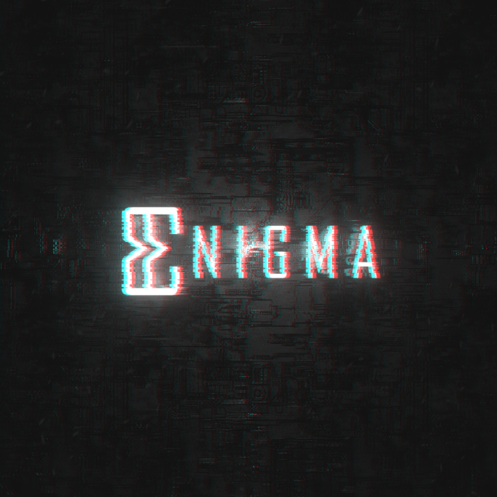

# Enigma
<!--WORKFLOW-->

 

<!--LOGO-->

<!--DESCRIOTION-->
Encrypt & Decrypt your important data

## Supported Algorithm
- AES-CBC

## Compiling
- <i>Clone Repository</i> : `$ git clone https://github.com/BaderEddineOuaich/Enigma.git`  

 

 <strong>Windows</strong> :  
 - Extract premake5 binary in `./Premake/Windows/premake-5.0.0-alpha15-windows.zip` 
<strong>Method 1: Visual Studio 16 2019</strong>
 - Run `Gen-Windows-vs2019.bat` to generate Visual Studio 16 2019 Project  
 - Open Enigma.sln and Change configuration to Release or Dist
 - Build Solution and Run `./Bin/Release-windows-x86_64/Enigma/Enigma.exe` 
 - Copy Resources/ folder next to the executable at '.\Bin\Release-windows-x86_64\Enigma\Enigma.exe' and run it 
<strong>Method 2 (Unstable): Makefile (GMake2)</strong>
 - Run `Gen-Windows-Makefile.bat` to generate project Makefiles 
 - Run `make config=release CC="path/to/your/c/compiler" CXX="path/to/your/c++/compiler"` 
   example: `make config=release CC=D:/MinGW/10.1.0/mingw64/bin/gcc.exe  CXX=D:/MinGW/10.1.0/mingw64/bin/g++.exe -j 2` 
 - Copy Resources/ folder next to the executable at '.\Bin\Release-windows-x86_64\Enigma\Enigma.exe' and run it

 

 <strong>Linux</strong> :  
 - Install Latest gcc & g++ Compiler 
  `sudo add-apt-repository ppa:ubuntu-toolchain-r/test` 
  `sudo apt update` 
  `sudo apt install gcc-10 g++-10` 
 - Install necessary libs 
  `sudo apt install libgl1-mesa-dev libxi-dev libx11-dev libxcursor-dev libxrandr-dev libxcomposite-dev libxinerama-dev`
 - Extract premake5 binary  
  `tar xvzf ./Premake/Linux/premake-5.0.0-alpha15-linux.tar.gz -C ./Premake/Linux/`
 - Run `sudo bash ./Gen-Linux-Makefile.sh` to generate project Makefiles
 - `make config=release CC=gcc-10 CPP=g++-10 -j X`   
   replace X with number of threads to use for compilation, the more the faster 
   replace release with dist for full performance
 - Copy Resources/ folder next to the executable at './Bin/Release-linux-x86_64/Enigma/Enigma'
 - Run Enigma Binary `./Bin/Release-linux-x86_64/Enigma/Enigma`

 

<strong>MacOS TODO</strong> :  
- Run `sudo bash ./Gen-MacOS-XCode.sh` to generate XCode Project 

## Status (Under Development)
Latest Test on `Windows 10 Version 20H2`
<image src="Resources/Dev Process/Windows-Latest.png"/>
 
Latest Test on `Linux Mint Cinnamon 19.3 Tricia`
<image src="Resources/Dev Process/Linux-Latest.png"/>

## License
[MIT License](LICENSE.md)

## Features and bugs

If you face any problems feel free to open an issue at the [issue tracker][tracker]. If you feel the program is missing a feature, please raise a ticket on Github. Pull requests are also welcome.

[tracker]: https://github.com/BaderEddineOuaich/Enigma/issues
