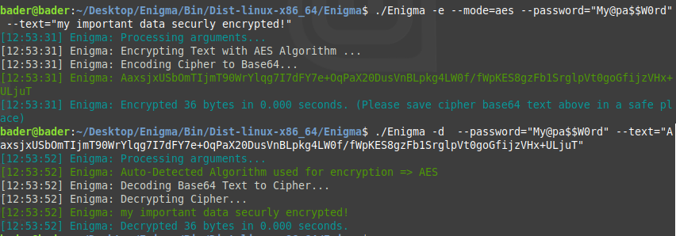
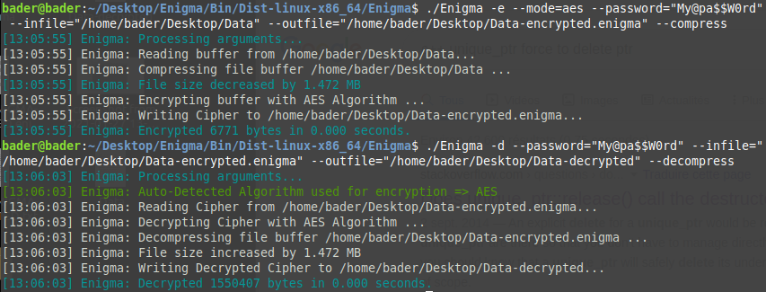
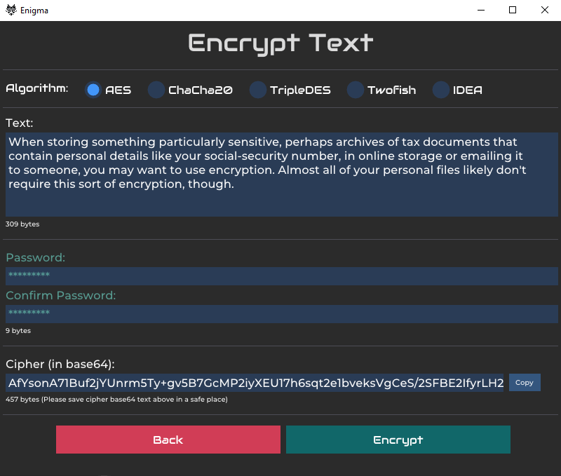
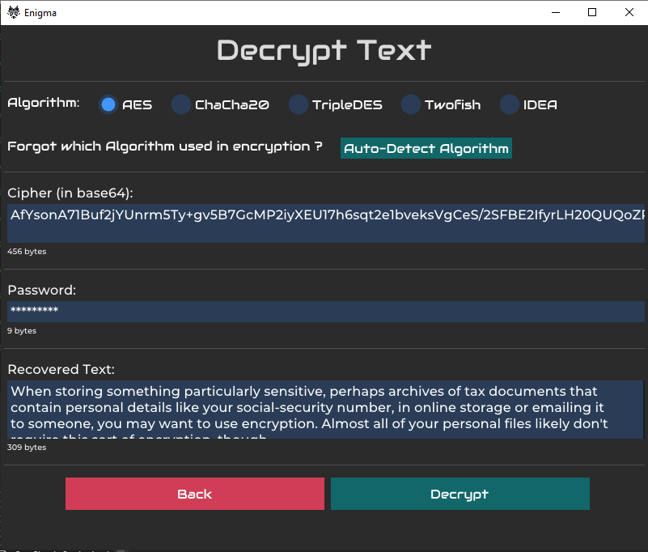
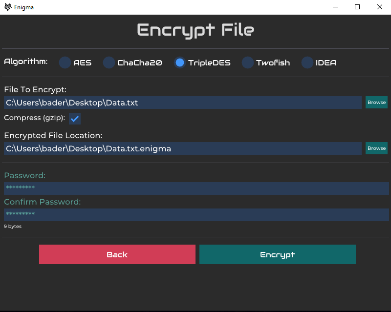
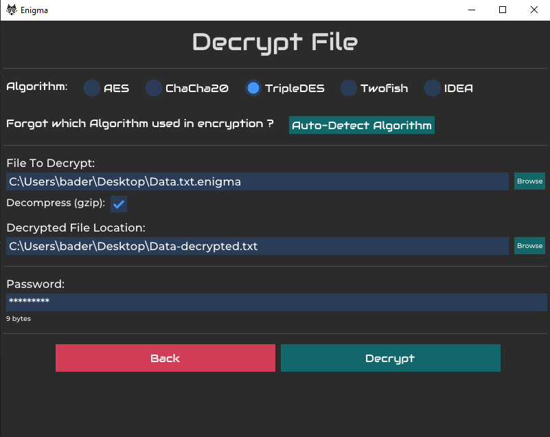

# Enigma
[](https://github.com/baderouaich/Enigma/blob/main/LICENSE.md)
[](https://github.com/baderouaich/Enigma/actions?workflow=static-analysis)
[](https://baderouaich.github.io/Enigma)
[](https://img.shields.io/badge/C++-20-blue.svg?style=flat&logo=c%2B%2B)


<!--LOGO-->
<!--  -->
<!--  -->


<!--DESCRIOTION-->
A Simple, Reliable and Efficient Encryption Tool<br>
<!--
Built to solve 3 problems i had:
- huge personnel files take too much space in storage clouds <strong>(Solved by Compression)</strong>
- if someone accessed my storage's account, you know. <strong>(Solved by Encryption)</strong>
- just can't trust other programs to do the above two for me plus Enigma is a cool name to waste (in memory of Alan Turing)
-->

### CI Status

| Operating system | Build status                                                                                                                                                                                    |
|------------------|-------------------------------------------------------------------------------------------------------------------------------------------------------------------------------------------------|
| Ubuntu (x64)     | [](https://github.com/baderouaich/Enigma/actions/workflows/build-ubuntu.yml)    |
| Windows (x64)    | [](https://github.com/baderouaich/Enigma/actions/workflows/build-windows.yml) |

## Supported Encryption Algorithms
All [Authenticated Encryption](https://www.cryptopp.com/wiki/Authenticated_Encryption)
- :white_check_mark: <strong>AES-GCM</strong> (Recommended)
- :white_check_mark: <strong>Twofish-GCM</strong>
- :white_check_mark: <strong>TripleDES-EAX</strong>
- :white_check_mark: <strong>Blowfish-EAX</strong>
- :white_check_mark: <strong>IDEA-EAX</strong>
- :white_check_mark: <strong>ChaCha20Poly1305</strong>
<!-- - :white_check_mark: <strong>RSA-OAEP-SHA256</strong> -->
<!-- - [ ] algo || [x] algo -->


## Extra Tools
- Password Generator
- Hashing Algorithms (MD2, MD4, MD5, SHA1, SHA224, SHA256, SHA384, SHA512, SHAKE128, SHAKE256, KECCAK224, KECCAK256, KECCAK384, KECCAK512, TIGER, WHIRLPOOL)
- XOR Encryption
- System & Hardware Information

<!--
## Features
- :zap: Very fast Encryption & Decryption
- :hammer_and_wrench: Useful tools like Password Generator, Hashing and System & Hardware Information
- :computer: User Interface & Command-Line Interface support
- :shield: Strongest Encryption Algorithms of the Decade
- :package: GZip Compression by default to reduce cipher size if sharing or uploading files to clouds
- :briefcase: SQLite3 Database system to save, import and export encryption records
- :octocat: Open Source of course!
-->

<!--- :detective: Auto-detect algorithm used for encryption (no need to keep remembering which algorithm you used, just remember your password, and store cipher base64-text or encrypted file somewhere preferably clouds)-->

<!--
## NOTES
- Encryption passwords are NOT saved into the database.
- Import/Export your database by copying or replacing database file `Enigma.db` located in `./res/database/`
-->

## Enigma UI
- Main Menu

- Straight forward

- Save Encryptions to a local database (an SQLite3 database which you can export/import)


[//]: # (- Compression is ON by default)
[//]: # (![2]&#40;https://github.com/baderouaich/Enigma/assets/49657842/31a9751c-d3cd-4cdd-b5d7-19f08c10ceeb&#41;)

- Extra Utilities


## Enigma CLI
```text
Usage:
  Enigma [OPTION...]

  -e, --encrypt                 Encrypt operation
  -d, --decrypt                 Decrypt operation
  -a, --algorithm [AES, Twofish, TripleDES, Blowfish, IDEA, ChaCha20] Encryption/Decryption algorithm (default: AES)
  -p, --password arg            Encryption password
  -t, --text arg                Text to Encrypt or Decrypt (base64)
  -i, --infile arg              Input File to Encrypt/Decrypt
  -o, --outfile arg             Output File to Encrypt/Decrypt
  -s, --save                    Save encryption record to database
  -l, --list                    List saved encryption records from database
  -h, --help                    Displays help message
  -v, --version                 Displays Enigma's version
      --check-for-updates       Check for new version releases
```

- Example encypting a text with AES-GCM:<br>
```batch
$ ./Enigma --encrypt --algorithm=aes --password="My@pa$$W0rd" --text="my important data securly encrypted!"
output: AaxsjxUSbOmTIjmT90WrYlqg7I7dFY7e+OqPaX20DusVnBLpkg4LW0f/fWpKES8gzFb1SrglpVt0goGfijzVHx+ULjuT
```
- Example decrypting a text with AES-GCM:<br>
```batch
$ ./Enigma -d -p "My@pa$$W0rd" -t "AaxsjxUSbOmTIjmT90WrYlqg7I7dFY7e+OqPaX20DusVnBLpkg4LW0f/fWpKES8gzFb1SrglpVt0goGfijzVHx+ULjuT"
output: my important data securly encrypted!
```
<!--<br>-->

- Example encypting a file with AES-GCM:<br>
```batch
$ ./Enigma -e -a AES --password "My@pa$$W0rd" --infile="/home/user/Desktop/Data.txt" --outfile="/home/user/Desktop/Data_encrypted.txt.enigma"
```
- Example decypting a file with AES-GCM:<br>
```batch
$ ./Enigma --decrypt --password="My@pa$$W0rd" --infile="/home/user/Desktop/Data_encrypted.txt.enigma" --outfile="/home/user/Desktop/Data_decrypted.txt"
```
<!-- <br> -->


<!--
        
-->

<!--
Latest Test on `Windows 10 Version 20H2`

<br>
Latest Test on `Linux Mint Cinnamon 19.3 Tricia`

-->


### Compiling & Installing
```shell
git clone https://github.com/baderouaich/Enigma
cd Enigma
mkdir build && cd build
cmake .. -G"Unix Makefiles" -DCMAKE_BUILD_TYPE=Release
make install -j$(nproc) # or -j%NUMBER_OF_PROCESSORS% on Windows
```
- All Enigma files will be installed to `/home/$(whoami)/Enigma/` (**Linux**) |  `C:\Program Files\Enigma\` (**Windows**)
- To uninstall simply remove the installed `Enigma/` directory

<!--
## Compiling
- <i>Clone Repository</i> : `$ git clone https://github.com/baderouaich/Enigma.git`<br>

### Windows Visual Studio 19 2022
- Extract premake5 binary in `./Premake/Windows/premake-5.0.0-beta1-windows.zip`<br>
- Run `./Scripts/Gen-Windows-vs2019.bat` to generate Visual Studio 16 2019 project solution files
- Open Enigma.sln and Change configuration to Release or Dist
- Build & Run Solution


### Linux GNU Makefile 
> Bellow steps are equivelent to running script `sudo bash ./Scripts/Linux-Build-Release.sh`
 - Install latest c++ compiler (gcc or clang)<br>
  `$ sudo add-apt-repository ppa:ubuntu-toolchain-r/ppa`<br>
  `$ sudo apt update`<br>
  gcc: `$ sudo apt install gcc-12 g++-12` or clang: `$ sudo apt install clang-14 clang++-14`<br>
 - Install necessary libs (opengl, x11, ...)<br>
  `$ sudo apt install libgl1-mesa-dev libxi-dev libx11-dev libxcursor-dev libxrandr-dev libxcomposite-dev libxinerama-dev libtbb-dev`
 - Extract premake5 binary<br>
  `$ tar xvzf ./Premake/Linux/premake-5.0.0-beta1-linux.tar.gz -C ./Premake/Linux/`
 - Run `$ sudo bash ./Scripts/Gen-Linux-Makefile.sh` to generate project Makefiles
 - Compile with gcc: `$ make config=release CC=gcc-12 CPP=g++-12 -j$(nproc)` or clang: `$ make config=release CC=clang-14 CPP=clang++-14 -j$(nproc)` <br> 
 - Run Enigma Binary `$ ./Bin/Release-linux-x86_64/Enigma/Enigma`

### MacOS TODO (when i figure out a way to test macos on vm)
- Run `$ sudo bash ./Scripts/Gen-MacOS-XCode.sh` to generate XCode project files<br> 


 -->

## License
[MIT License](LICENSE.md)


## Features and bugs

If you face any problems feel free to open an issue at the [issue tracker][tracker]. If you feel the program is missing a feature, please raise a ticket on Github. Pull requests are also welcome.

[tracker]: https://github.com/baderouaich/Enigma/issues
